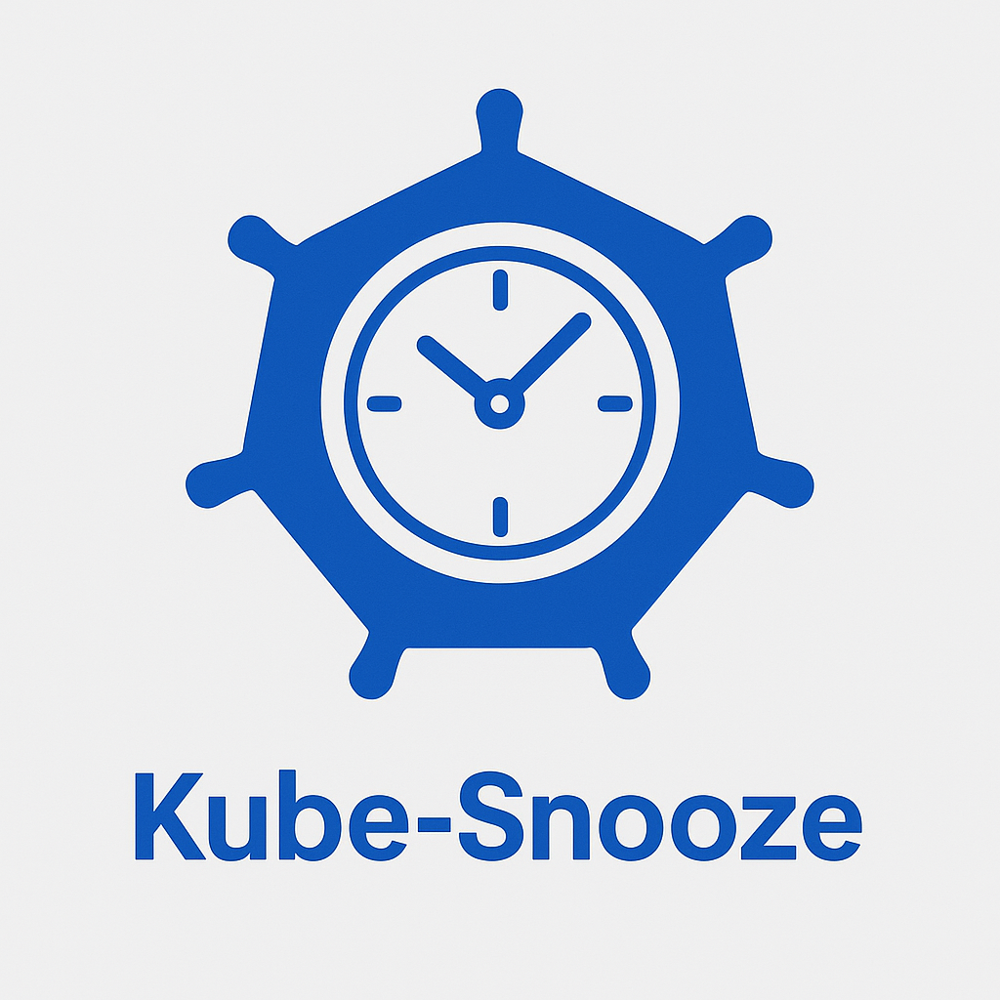

<div align="center">
  
  
  **Automated Kubernetes Resource Management for Cost Optimization**
  
  [](https://goreportcard.com/report/github.com/AsfandToor/kube-snooze)
  [](https://opensource.org/licenses/Apache-2.0)
  [](https://golang.org)
  [](https://kubernetes.io)
</div>

---

## Overview

Kube-Snooze is a Kubernetes operator that intelligently manages your cluster resources by automatically scaling down or deleting resources during quiet periods. This helps reduce costs and resource consumption while maintaining full control over when and how resources are managed.

### Key Features

- **Smart Scheduling**: Flexible time-based scheduling with timezone support
- **Resource Targeting**: Precise resource selection using labels and annotations
- **State Preservation**: Automatic backup and restoration of resource states

## Installation

`kubectl apply -f https://raw.githubusercontent.com/asfandtoor/kube-snooze/main/releases/v0.1.0/kube-snooze.yaml`

### Your First SnoozeWindow

Create a simple snooze window for weekend cost savings:

```yaml
apiVersion: scheduling.codeacme.org/v1alpha1
kind: SnoozeWindow
metadata:
  name: weekend-snooze
  namespace: default
spec:
  labelSelector:
    environment: "development"
    app: "my-app"
  
  timezone: "America/New_York"
  
  snoozeSchedule:
    startTime: "18:00"
    endTime: "08:00"
    days: ["Friday", "Saturday", "Sunday"]
```

Add the labels to resources you want to manage:

```yaml
metadata:
  labels:
    kube-snooze/enabled: "true"
```

## Specifications

### SnoozeWindow Specification

| Field | Type | Required | Description |
|-------|------|----------|-------------|
| `labelSelector` | `map[string]string` | Yes | Labels to select resources |
| `timezone` | `string` | Yes | Timezone for schedule calculations |
| `snoozeSchedule` | `SnoozeScheduleSpec` | Yes | When to apply snooze actions |

### SnoozeSchedule Specification

| Field | Type | Required | Description |
|-------|------|----------|-------------|
| `startTime` | `string` | Yes | Start time in HH:MM format |
| `endTime` | `string` | Yes | End time in HH:MM format |
| `days` | `[]string` | No | Days of the week (Monday, Tuesday, etc.) |
| `frequency` | `string` | No | Frequency pattern (future feature) |
| `date` | `string` | No | Specific date for one-time events |

<!-- ### Resource Annotations

| Annotation | Value | Description |
|------------|-------|-------------|
| `kube-snooze/enabled` | `"true"` | Enable snoozing for this resource |
| `kube-snooze/policy` | `"policy-name"` | Associate with specific policy |
| `kube-snooze/backup-full-state` | `"true"` | Backup complete resource state | -->

### View Managed Resources

```bash
kubectl get deployments,statefulsets,cronjobs -A \
  -o jsonpath='{range .items[?(@.metadata.annotations.kube-snooze/enabled=="true")]}{.kind}/{.metadata.namespace}/{.metadata.name}{"\n"}{end}'
```